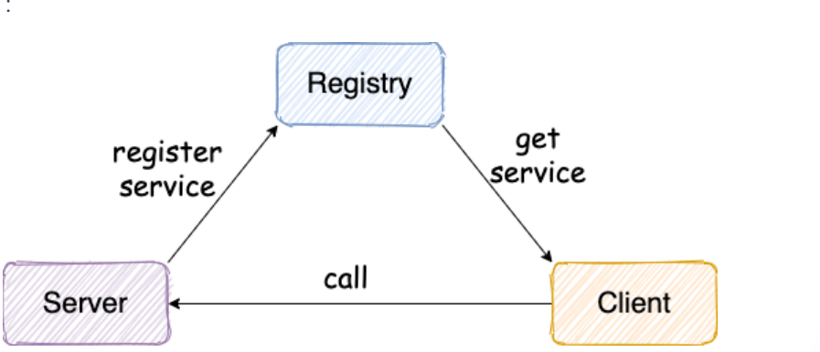
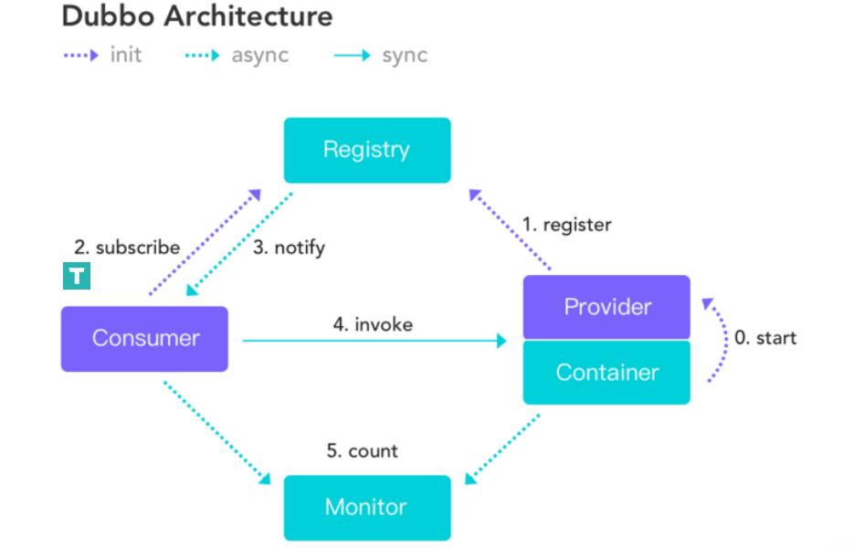
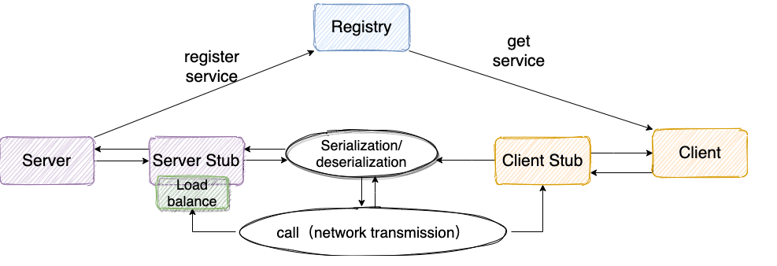
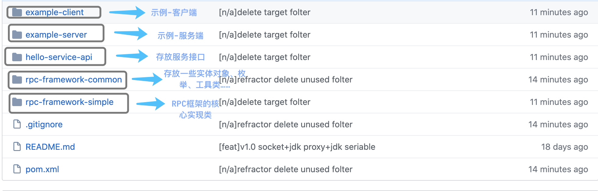
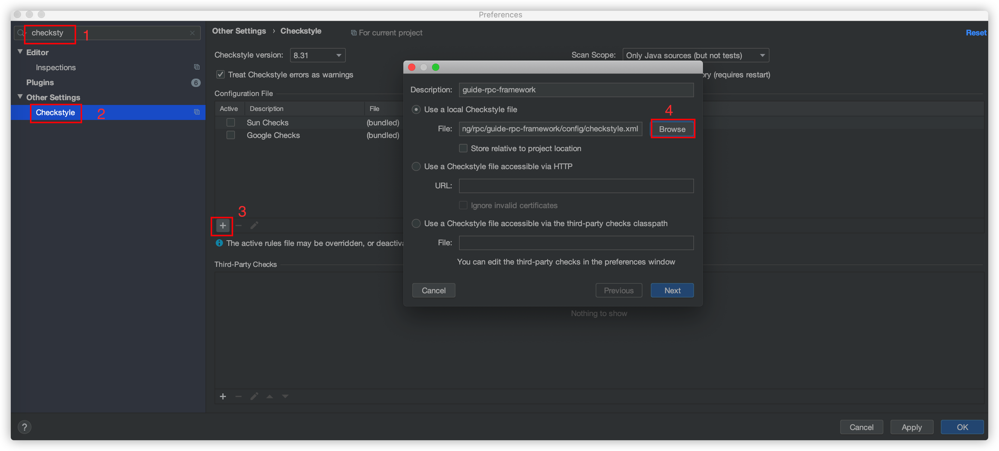
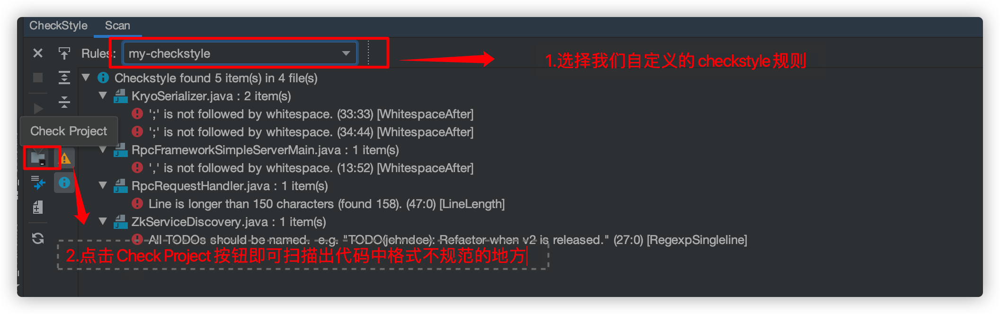

# RPC框架基本结构

服务提供端 Server 向注册中心注册服务，服务消费者 Client 通过注册中心拿到服务相关信息，然后再通过网络请求服务提供端 Server。
以Dubbo框架作为参考


# 设计RPC框架的基本思路

1.注册中心 ：注册中心首先是要有的，推荐使用 Zookeeper。注册中心负责服务地址的注册与查找，相当于目录服务。服务端启动的时候将服务名称及其对应的地址(ip+port)注册到注册中心，
  服务消费端根据服务名称找到对应的服务地址。有了服务地址之后，服务消费端就可以通过网络请求服务端了。
2.网络传输 ：既然要调用远程的方法就要发请求，请求中至少要包含你调用的类名、方法名以及相关参数吧！推荐基于 NIO 的 Netty 框架。
3.序列化 ：既然涉及到网络传输就一定涉及到序列化，你不可能直接使用 JDK 自带的序列化吧！JDK 自带的序列化效率低并且有安全漏洞。 所以，你还要考虑使用哪种序列化协议，比较常用的有 hession2、kyro、protostuff。
4.动态代理 ： 另外，动态代理也是需要的。因为 RPC 的主要目的就是让我们调用远程方法像调用本地方法一样简单，使用动态代理可以屏蔽远程方法调用的细节比如网络传输。也就是说当你调用远程方法的时候，实际会通过代理对象来传输网络请求，不然的话，怎么可能直接就调用到远程方法呢？
5.负载均衡 ：负载均衡也是需要的。为啥？举个例子我们的系统中的某个服务的访问量特别大，我们将这个服务部署在了多台服务器上，当客户端发起请求的时候，多台服务器都可以处理这个请求。那么，如何正确选择处理该请求的服务器就很关键。假如，你就要一台服务器来处理该服务的请求，那该服务部署在多台服务器的意义就不复存在了。负载均衡就是为了避免单个服务器响应同一请求，容易造成服务器宕机、崩溃等问题，我们从负载均衡的这四个字就能明显感受到它的意义。

# 项目模块概览


# 运行项目
## 导入项目
fork项目到自己的仓库，然后克隆项目到自己的本地，使用 IDEA 打开，等待项目初始化完成。

## 初始化git hooks
这一步主要是为了在 commit 代码之前，跑 Check Style，保证代码格式没问题，如果有问题的话就不能提交。

以下演示的是 Mac/Linux 对应的操作，Window 用户需要手动将 config/git-hooks 目录下的pre-commit 文件拷贝到 项目下的 .git/hooks/ 目录。

执行下面这些命令：

➜  guide-rpc-framework git:(master) ✗ chmod +x ./init.sh
➜  guide-rpc-framework git:(master) ✗ ./init.sh
init.sh 这个脚本的主要作用是将 git commit 钩子拷贝到项目下的 .git/hooks/ 目录，这样你每次 commit 的时候就会执行了。

## CheckStyle插件下载和配置
IntelliJ IDEA-> Preferences->Plugins->搜索下载 CheckStyle 插件，然后按照如下方式进行配置.


配置完成之后，按照如下方式使用这个插件！


## 下载运行Zookeeper
这里使用 Docker 来下载安装。

下载：

docker pull zookeeper:3.5.8
运行：

docker run -d --name zookeeper -p 2181:2181 zookeeper:3.5.8

# 使用
## 服务提供端
```java
@Slf4j
@RpcService(group = "test1", version = "version1")
public class HelloServiceImpl implements HelloService {
    static {
        System.out.println("HelloServiceImpl被创建");
    }

    @Override
    public String hello(Hello hello) {
        log.info("HelloServiceImpl收到: {}.", hello.getMessage());
        String result = "Hello description is " + hello.getDescription();
        log.info("HelloServiceImpl返回: {}.", result);
        return result;
    }
}
	
@Slf4j
public class HelloServiceImpl2 implements HelloService {

    static {
        System.out.println("HelloServiceImpl2被创建");
    }

    @Override
    public String hello(Hello hello) {
        log.info("HelloServiceImpl2收到: {}.", hello.getMessage());
        String result = "Hello description is " + hello.getDescription();
        log.info("HelloServiceImpl2返回: {}.", result);
        return result;
    }
}
```
发布服务(使用 Netty 进行传输)：

```java
/**
 * Server: Automatic registration service via @RpcService annotation
 *
 * @author shuang.kou
 * @createTime 2020年05月10日 07:25:00
 */
@RpcScan(basePackage = {"github.javaguide.serviceimpl"})
public class NettyServerMain {
    public static void main(String[] args) {
        // Register service via annotation
        new AnnotationConfigApplicationContext(NettyServerMain.class);
        NettyServer nettyServer = new NettyServer();
        // Register service manually
        HelloService helloService2 = new HelloServiceImpl2();
        RpcServiceProperties rpcServiceConfig = RpcServiceProperties.builder()
                .group("test2").version("version2").build();
        nettyServer.registerService(helloService2, rpcServiceConfig);
        nettyServer.start();
    }
}
```

## 服务消费端
```java
@Component
public class HelloController {

    @RpcReference(version = "version1", group = "test1")
    private HelloService helloService;

    public void test() throws InterruptedException {
        String hello = this.helloService.hello(new Hello("111", "222"));
        //如需使用 assert 断言，需要在 VM options 添加参数：-ea
        assert "Hello description is 222".equals(hello);
        Thread.sleep(12000);
        for (int i = 0; i < 10; i++) {
            System.out.println(helloService.hello(new Hello("111", "222")));
        }
    }
}
```

```java
ClientTransport rpcRequestTransport = new SocketRpcClient();
RpcServiceProperties rpcServiceConfig = RpcServiceProperties.builder()
        .group("test2").version("version2").build();
RpcClientProxy rpcClientProxy = new RpcClientProxy(rpcRequestTransport, rpcServiceConfig);
HelloService helloService = rpcClientProxy.getProxy(HelloService.class);
String hello = helloService.hello(new Hello("111", "222"));
System.out.println(hello);
```

